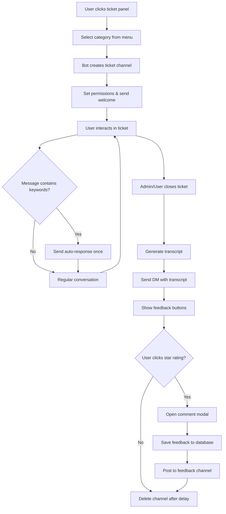
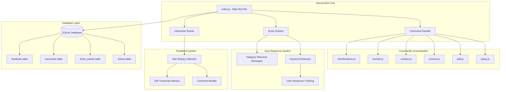

# PCRP Discord Ticket System Bot

A comprehensive Discord ticket management bot built with Discord.js v14 and SQLite. This bot provides a complete support ticket system with advanced features including automatic responses, user feedback collection, and administrative commands.

## 🚀 Features

### Core Ticket Management
- **Interactive Ticket Creation**: Select menu with 7 predefined categories
- **Automatic Channel Management**: Creates dedicated ticket channels with proper permissions
- **Smart Naming Convention**: `pcrp-username-category-###` format
- **Auto-reconnection**: Automatically reconnects to existing tickets on restart
- **Transcript Generation**: Saves conversation history before ticket deletion

### Administrative Commands
- `/setup` - Initialize ticket panel in channel
- `/add <user>` - Add user to ticket
- `/remove <user>` - Remove user from ticket  
- `/rename <name>` - Rename ticket channel
- `/transfer` - Move ticket to different category
- `/transferadmin <admin> [reason]` - Notify specific admin with DM

### Smart Auto-Response System
- **Category-specific welcomes**: Tailored messages for each ticket type
- **Keyword detection**: Auto-replies for common terms
  - `upi` → UPI Payment ID
  - `paypal` → PayPal Payment Link
  - `refund` → No Refund Policy
  - `missing item`, `bug report` → Proof requirements
- **One-time responses**: Each user gets only one response per keyword type

### User Feedback System
- **Star ratings**: 1-5 star feedback collection
- **Comment system**: Optional text feedback via modals
- **DM delivery**: Transcripts sent via direct message
- **Feedback channel**: Automatic routing to designated channel

### Database & Persistence
- **SQLite database**: Local storage with 4 main tables
- **Automatic backups**: Transcript files saved locally
- **Data integrity**: Comprehensive error handling and validation

## 📋 Requirements

### Discord Setup
- Discord Bot Token
- Discord Server (Guild)
- Admin permissions for the bot

### System Requirements
- Node.js v16.11.0 or higher
- npm (Node Package Manager)
- 512MB RAM minimum
- 1GB disk space

### Dependencies
```json
{
  "discord.js": "^14.x",
  "sqlite3": "^5.x",
  "dotenv": "^16.x"
}
```

## 🔧 Installation & Setup

### 1. Clone/Download Project
```bash
git clone <repository-url>
cd pcrp-ticket-bot
```

### 2. Install Dependencies
```bash
npm install
```

### 3. Environment Configuration
Create a `.env` file in the root directory:
```env
DISCORD_TOKEN=your_discord_bot_token_here
```

### 4. Bot Configuration
Edit `config.json` with your Discord server details:
```json
{
    "guildId": "your_guild_id",
    "ticketChannelId": "channel_for_ticket_panel",
    "logsChannelId": "channel_for_logs",
    "adminRoleId": "admin_role_id",
    "feedbackChannelId": "feedback_channel_id",
    "maxTicketsPerUser": 1,
    "autoDeleteAfterClose": 5000
}
```

### 5. Run the Bot
```bash
node index.js
```

## 📊 Process Flow Diagram



## 🏗️ Architecture Overview



## ☁️ AWS Linux Hosting Guide

### Prerequisites
- AWS EC2 Instance (t2.micro or larger)
- Ubuntu 20.04 LTS or Amazon Linux 2
- SSH access to your instance

### Step 1: Connect to EC2 Instance
```bash
ssh -i your-key.pem ubuntu@your-ec2-public-ip
```

### Step 2: Update System
```bash
sudo apt update && sudo apt upgrade -y
```

### Step 3: Install Node.js
```bash
# Install Node.js 18.x
curl -fsSL https://deb.nodesource.com/setup_18.x | sudo -E bash -
sudo apt-get install -y nodejs

# Verify installation
node --version
npm --version
```

### Step 4: Install Git
```bash
sudo apt install git -y
```

### Step 5: Clone and Setup Project
```bash
# Clone your project
git clone <your-repository-url>
cd pcrp-ticket-bot

# Install dependencies
npm install

# Create environment file
nano .env
# Add your DISCORD_TOKEN
```

### Step 6: Install Process Manager (PM2)
```bash
# Install PM2 globally
sudo npm install -g pm2

# Start the bot with PM2
pm2 start index.js --name "pcrp-ticket-bot"

# Enable auto-start on system reboot
pm2 startup
pm2 save
```

### Step 7: Configure Security Group
In AWS Console:
1. Go to EC2 → Security Groups
2. Select your instance's security group
3. Add inbound rules if needed (usually not required for Discord bots)

### Step 8: Monitor and Manage
```bash
# View bot status
pm2 status

# View logs
pm2 logs pcrp-ticket-bot

# Restart bot
pm2 restart pcrp-ticket-bot

# Stop bot
pm2 stop pcrp-ticket-bot
```

## 🪟 Windows Hosting Guide

### Prerequisites
- Windows 10/11 or Windows Server
- Administrator access

### Step 1: Install Node.js
1. Download Node.js from [nodejs.org](https://nodejs.org/)
2. Run the installer and follow the setup wizard
3. Verify installation:
```cmd
node --version
npm --version
```

### Step 2: Install Git
1. Download Git from [git-scm.com](https://git-scm.com/)
2. Install with default settings

### Step 3: Setup Project
```cmd
# Open Command Prompt as Administrator
# Clone project
git clone <your-repository-url>
cd pcrp-ticket-bot

# Install dependencies
npm install

# Create .env file
echo DISCORD_TOKEN=your_token_here > .env
```

### Step 4: Install PM2 for Windows
```cmd
# Install PM2 globally
npm install -g pm2
npm install -g pm2-windows-startup

# Configure PM2 for Windows startup
pm2-startup install
```

### Step 5: Start Bot with PM2
```cmd
# Start the bot
pm2 start index.js --name "pcrp-ticket-bot"

# Save PM2 configuration
pm2 save
```

### Step 6: Windows Service (Alternative)
For running as a Windows Service, use `node-windows`:
```cmd
npm install -g node-windows

# Create service script (service.js)
echo const Service = require('node-windows').Service; > service.js
echo const svc = new Service({ >> service.js
echo   name: 'PCRP Ticket Bot', >> service.js
echo   description: 'Discord ticket management bot', >> service.js
echo   script: require('path').join(__dirname, 'index.js') >> service.js
echo }); >> service.js
echo svc.install(); >> service.js

# Install as service
node service.js
```

### Step 7: Manage Windows Service
```cmd
# View PM2 status
pm2 status

# View logs
pm2 logs

# Restart service
pm2 restart pcrp-ticket-bot
```

## 🔧 Configuration Options

### Bot Configuration (config.json)
```json
{
    "guildId": "Discord server ID",
    "ticketChannelId": "Channel where ticket panel is created",
    "logsChannelId": "Channel for bot logs",
    "adminRoleId": "Role ID for admin permissions",
    "feedbackChannelId": "Channel for feedback posts",
    "ticketCategoryId": "Category for ticket channels (optional)",
    "maxTicketsPerUser": 1,
    "autoDeleteAfterClose": 5000,
    "transcriptChannelId": "Channel for transcript backups (optional)"
}
```

### Environment Variables
- `DISCORD_TOKEN` - Your Discord bot token (required)
- `NODE_ENV` - Set to 'production' for production deployment

## 📝 Database Schema

### tickets table
```sql
CREATE TABLE tickets (
    id INTEGER PRIMARY KEY AUTOINCREMENT,
    channel_id TEXT UNIQUE,
    user_id TEXT,
    username TEXT,
    category TEXT,
    status TEXT DEFAULT 'open',
    created_at DATETIME DEFAULT CURRENT_TIMESTAMP,
    closed_at DATETIME,
    claimed_by TEXT
);
```

### feedback table
```sql
CREATE TABLE feedback (
    id INTEGER PRIMARY KEY AUTOINCREMENT,
    ticket_id INTEGER,
    user_id TEXT,
    rating INTEGER,
    comment TEXT,
    created_at DATETIME DEFAULT CURRENT_TIMESTAMP,
    FOREIGN KEY (ticket_id) REFERENCES tickets (id)
);
```

## 🚨 Troubleshooting

### Common Issues

1. **Bot not responding to commands**
   - Check bot permissions in Discord
   - Verify DISCORD_TOKEN in .env file
   - Ensure bot is online and has proper intents

2. **Database errors**
   - Check file permissions for tickets.db
   - Ensure SQLite3 is properly installed
   - Verify disk space availability

3. **Auto-responses not working**
   - Check if bot has message content intent
   - Verify keyword detection is not blocked by user response tracking
   - Clear user response cache if needed

4. **Commands not appearing in Discord**
   - Verify guild ID in config.json
   - Check bot permissions for slash commands
   - Restart bot to refresh command registration

### Debug Mode
Add to .env for detailed logging:
```env
DEBUG=true
```

### Log Locations
- **Linux**: `/var/log/pm2/` or use `pm2 logs`
- **Windows**: PM2 logs via `pm2 logs` command

## 📊 Monitoring & Maintenance

### Health Checks
```bash
# Check bot process
pm2 status

# Check disk space
df -h

# Check memory usage
free -m

# Check database size
ls -lh tickets.db
```

### Backup Procedures
```bash
# Backup database
cp tickets.db tickets_backup_$(date +%Y%m%d).db

# Backup transcripts
tar -czf transcripts_backup_$(date +%Y%m%d).tar.gz transcript-*.html
```

### Updates
```bash
# Pull latest code
git pull origin main

# Install new dependencies
npm install

# Restart bot
pm2 restart pcrp-ticket-bot
```

## 📞 Support

For issues and support:
1. Check the troubleshooting section above
2. Review Discord bot permissions
3. Check server logs for error messages
4. Verify all configuration values

## 📄 License

This project is for internal use. Modify as needed for your Discord server requirements.

---

**Last Updated**: December 2024  
**Version**: 2.0  
**Compatible**: Discord.js v14, Node.js v16+